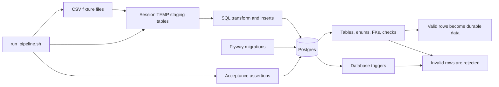
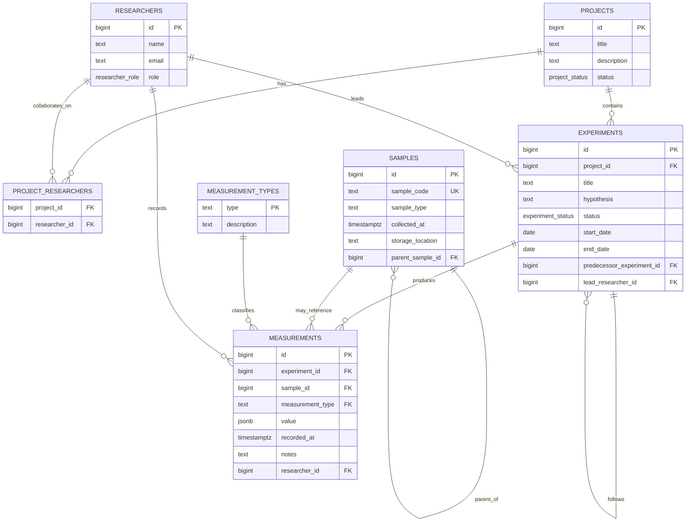
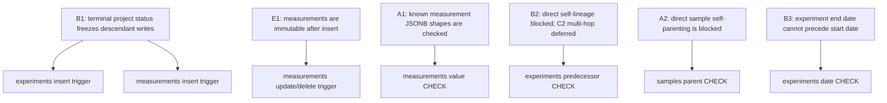

# Architecture

This document is the high-level map for implementation. It is intentionally source-readable:
Mermaid diagrams stay in Markdown so GitHub and agents can read the same artifact.

The core architectural decision comes from [A0](./QUESTIONS_ASSUMPTIONS.md#a-language-and-core-concepts):
this is a **CSV ingestion workflow**, not a web API or full application layer. Postgres is the
source of truth, and domain invariants are enforced by database constraints, foreign keys,
checks, and triggers.

## Runtime View

The diagram overlays three flows; their order is fixed — **Flyway provisions the schema first**,
then `run_pipeline.sh` ingests CSV fixtures and runs assertions against the live schema.

### Responsibilities

- **Flyway** owns schema history: tables, enums, constraints, checks, and triggers.
- **`run_pipeline.sh`** owns the executable proof: load seed data, ingest valid CSV files, reject
  invalid CSV files, and assert the interesting invariants.
- **Temporary staging tables** are per-ingestion SQL buffers, not a durable staging subsystem.
- **Postgres** is the final guard. There is no Zod, TypeScript service layer, repository layer,
  or API validator in this design.

## Domain Model

## Invariant Map

### Database-Enforced Rules

- Projects in terminal states (`completed`, `cancelled`) freeze new experiments and measurements
  beneath them; `planning` and `active` projects both accept writes.
- Measurements cannot be updated or deleted through normal database writes.
- Known measurement types use a `jsonb_typeof`-based `CHECK` on `measurements.value`.
- New measurement types can be registered as data first; hardening their JSONB shape is an
  additive migration when the shape becomes stable enough to enforce.
- Experiment and sample lineage block direct self-reference. Multi-hop cycle detection is
  deliberately deferred because CSV ingestion is treated as append-only historical import.
- Declarative constraints carry the rest: `samples.sample_code UNIQUE` (the lab's unique specimen
  id), `project_researchers PK(project_id, researcher_id)` (collaboration is M:N, deduplicated),
  enum domains on `researcher.role` and the two `*_status` columns, and `NOT NULL`/FK integrity
  across every relationship.

## Deliberate Non-Goals

- No web API, authentication, service classes, DTOs, or application-layer validation.
- No generated PNG/SVG architecture artifact unless a presentation needs one.
- No `experiment_samples` join table until the domain requires sample usage without a
  measurement row.
- No inventory management, depletion tracking, or sample state machine.
- No recursive lineage trigger until retroactive lineage editing becomes a real workflow.

For the step-by-step build order, see [implementation_plan.md](./implementation_plan.md).
